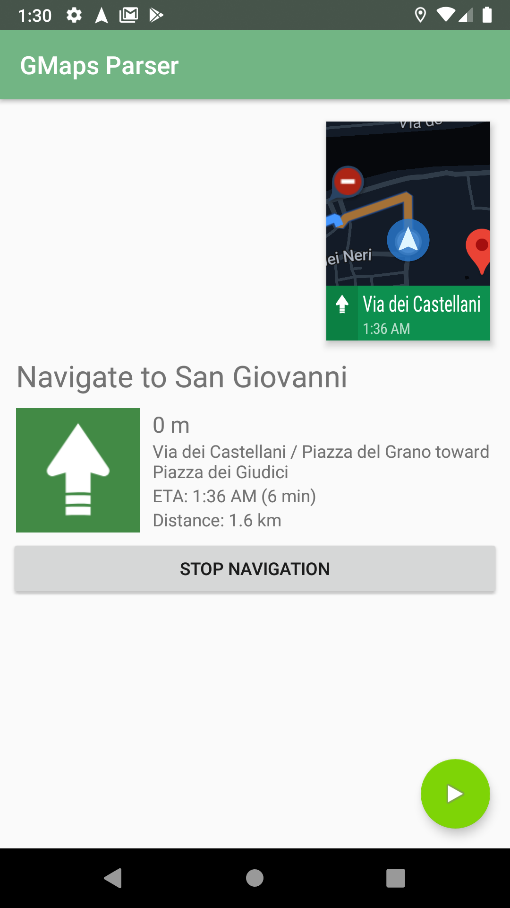

### Simple Google Maps Notifications parser for Android

A simple library (including a test service and application) written in kotlin
that allows to parse the [Google Maps android app](https://play.google.com/store/apps/details?id=com.google.android.apps.maps)
turn-by-turn navigation notifications in order to get textual navigation data
that can be exposed to other devices (such as wearables) or used in other
applications.

#### Example application

Here is provided a sample application that will get the notifications from the
service and will replicate the parsed data in the main screen.




### Usage

You can easily use these libraries using [jitpack](https://jitpack.io/#3v1n0/GMapsParser/).

For example:

```gradle
dependencies {
    // ...
    implementation 'com.github.3v1n0.GMapsParser:navparser:master-SNAPSHOT'
    implementation 'com.github.3v1n0.GMapsParser:navparser-activity:master-SNAPSHOT'
    // ...
}
```

[](https://jitpack.io/#3v1n0/GMapsParser)


#### LICENSE

This is released under the terms of [LGPL-3.0](LICENSE.md)
